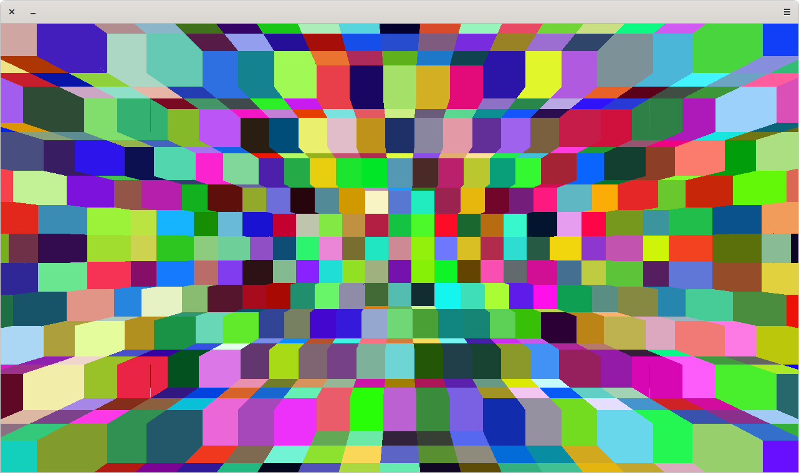
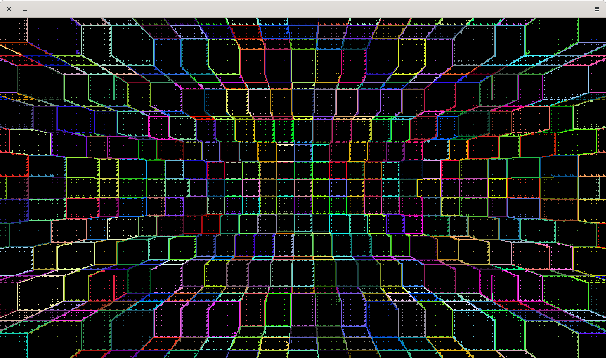

a raytracer for a world of voxels that uses fixed-point arithmetic

press ESC to exit, the left mouse button to move forwards, the delete key to remove the block currently pointed at, and f to toggle filled rendering

filled rendering:

non-filled rendering:
